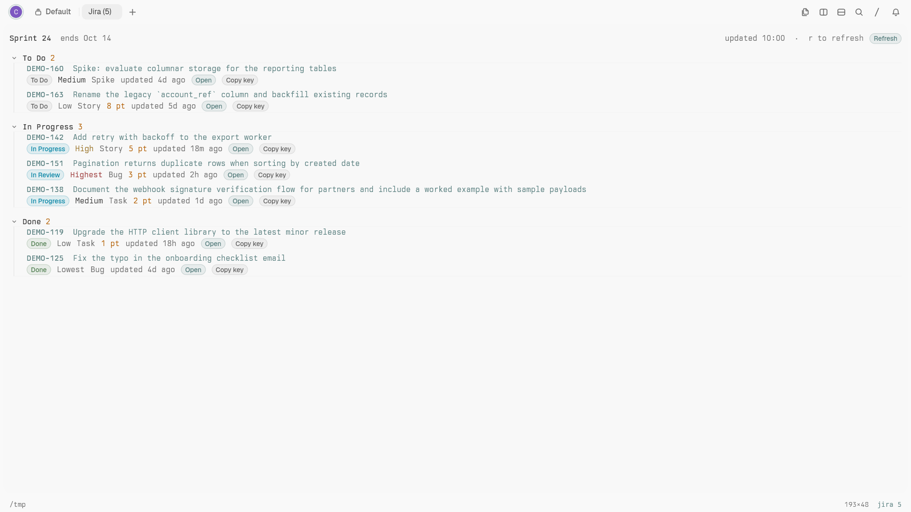

# Jira

A public Tern plugin that shows issues assigned to you in active Jira Cloud sprints. It uses Jira Cloud REST API v3 with an Atlassian email and API token; no Jira CLI or company-specific setup is required.



## Requirements

- Tern 0.6.0 or newer.
- A Jira Cloud site and an Atlassian API token.
- The Tern host (the session daemon, where panes run) must be able to reach your Jira site.

## What it does

- **Jira block**: issues matching the configured JQL, grouped by Jira status category (`To Do`, `In Progress`, `Done`) with a count per group.
- **Each row**: issue key and summary link on the first line; status, priority, issue type, story points when present, updated age and actions on a wrapping metadata line. Narrow panes keep the summary readable.
- **Row actions**: Open in Jira and Copy key. The row actions use a small action registry in `host.luau` so additional actions can be added independently.
- **Header**: active sprint name(s) and end date when Jira includes them in the issue's sprint field, last updated time, `r` refresh hint and a Refresh button.
- **Status line**: `jira <n>` for your non-done issues in the current result; click it to open or focus the Jira block.
- **Sign-in card**: explains missing or rejected credentials, lists the required environment variables without exposing their values, and links to Atlassian's API-token page.
- **Errors and empty results**: network/API failures show a retry card; a failed refresh preserves previously loaded issues. Empty results have a dedicated explanation.
- **Refresh**: polls every five minutes by default; press `r` or the Refresh button to refresh sooner.

The default query is:

```jql
assignee = currentUser() AND sprint in openSprints() ORDER BY status, priority DESC, updated DESC
```

The plugin uses `POST /rest/api/3/search/jql` and follows its pagination tokens, so group and status-line counts include every returned issue. It reads Jira story-point and sprint field IDs from `/rest/api/3/field`; it does not hard-code custom field IDs. Both company-managed `Story Points` and team-managed `Story point estimate` fields are supported. Story points are optional. Sprint name/end dates come from the issue's sprint field; no Agile API request is made.

## Sign in

Create an API token at [Atlassian API tokens](https://id.atlassian.com/manage-profile/security/api-tokens). Set these variables in the environment of the machine running Tern's session daemon:

```sh
export JIRA_BASE_URL="https://your-site.atlassian.net"
export JIRA_EMAIL="you@example.com"
export JIRA_API_TOKEN="your-api-token"
```

Restart the daemon after changing environment variables so its host-side plugin receives them. The token is only read from `JIRA_API_TOKEN`; it is never saved in `config.json`, logged, or included in a toast. Environment variables override the URL and email from config.

Requests require HTTPS. A bare hostname or an explicit `http://` site URL is
normalized to HTTPS before authentication is sent. URLs with embedded
credentials, a path or a query are rejected.

## Config

On first open, the plugin creates `config.json` in Tern's Jira plugin data directory (Linux: `~/.local/state/tern/plugin-data/jira/config.json`). It reads the file on each refresh. Missing or wrongly typed values use defaults; malformed JSON uses defaults and displays a warning in the block.

| Key | Default | Notes |
|---|---|---|
| `base_url` | `""` | Jira Cloud site URL; overridden by `JIRA_BASE_URL`. A bare hostname is accepted. |
| `email` | `""` | Atlassian account email; overridden by `JIRA_EMAIL`. |
| `jql` | `"assignee = currentUser() AND sprint in openSprints() ORDER BY status, priority DESC, updated DESC"` | Search query sent to Jira. |
| `poll_minutes` | `5` | Automatic refresh interval, clamped to 1–60 minutes. |

Example (do not put an API token in this file):

```json
{
  "base_url": "https://your-site.atlassian.net",
  "email": "you@example.com",
  "jql": "assignee = currentUser() AND sprint in openSprints() ORDER BY status, priority DESC, updated DESC",
  "poll_minutes": 5
}
```

## Limits

- Jira Cloud only. Use a site-scoped API token without scopes for Basic auth against your site URL; tokens requiring the `api.atlassian.com/ex/jira/...` gateway are not supported.
- Only active sprint names/end dates returned on matching issues are shown. Jira may omit sprint metadata from an issue response; in that case issue data still renders without sprint details.
- Story points are omitted when the site has no supported story-point field or the field is not populated.
- The plugin is read-only: transitions, comments, branch creation and sending issues to an agent are not implemented.

## Install

From the checked-out plugin directory:

```sh
tern plugin link .
tern plugin reload
```

Run `tern plugin types .` to regenerate `tern.d.luau` after a Tern update. Open the block with the **Open Jira** palette command (`plugin.jira.open`); the `jira <n>` status segment opens it too.

## Testing

Synthetic fixtures in `test/fixtures` keep the block deterministic and make no network requests:

```sh
# Open a fixture block in a fresh Tern window
JIRA_AUTOOPEN=fixture tern --control /tmp/jira.sock .

# Variants for sign-in and empty-result UI
JIRA_AUTOOPEN=fixture-signedout tern --control /tmp/jira.sock .
JIRA_AUTOOPEN=fixture-empty tern --control /tmp/jira.sock .
JIRA_AUTOOPEN=fixture-error tern --control /tmp/jira.sock .

# Live Jira data (requires host-side environment variables or config)
JIRA_AUTOOPEN=live tern --control /tmp/jira.sock .
```

Capture the block with the Tern control endpoint (not `grim`):

```sh
tern ctl --control /tmp/jira.sock shot issues
```

Float the test window and size its content to 1920×1080 physical pixels
(1536×864 logical pixels at display scale 1.25). Check the saved PNG with
`identify`, and copy it from `target/shots/tern/live/` to `test/screenshots/`.
Use a fresh window and a unique control socket for each variant.

API and refresh-state regressions (requires Python 3 and the
[Luau CLI](https://github.com/luau-lang/luau/releases)):

```sh
python3 test/smoke.py --luau luau
```

This executes the actual Luau modules with deterministic HTTP/UI boundaries:
mixed story-point fields, multi-page/deduplicated results, optional fields,
auth failures, invalid cursors, closed panes, HTTPS, timezone offsets and
sign-in/refresh recovery. It does not authenticate to a live Jira site.

Fixture screenshots in `test/screenshots/` (`issues.png`, `signin.png`,
`empty.png`) are captured at 1920×1080. Run `tern plugin types .`
to regenerate the checked-in SDK declarations.
